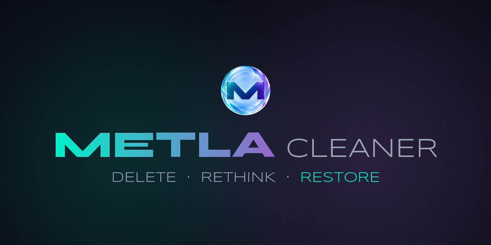
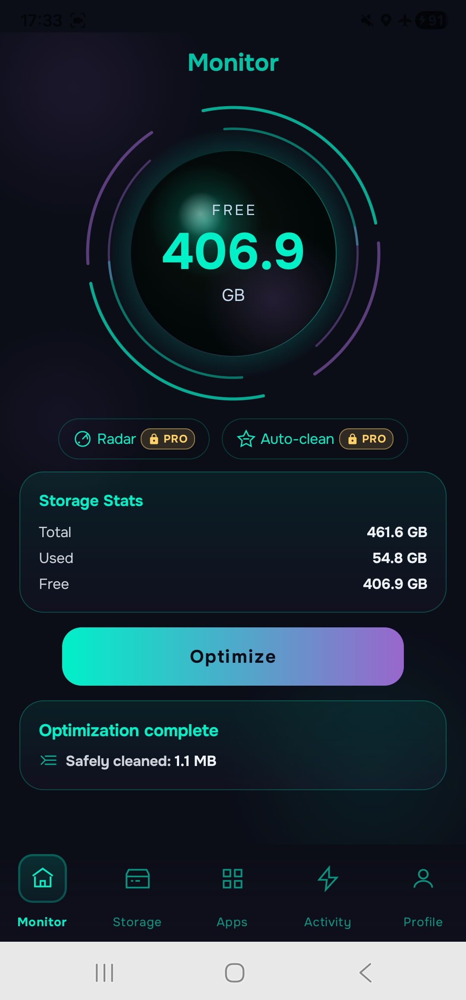
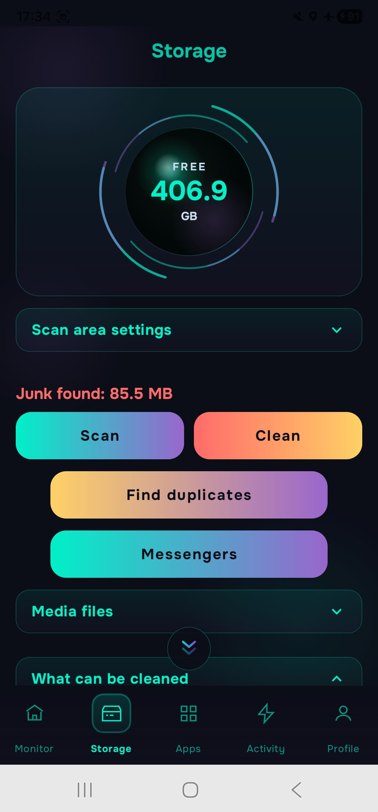
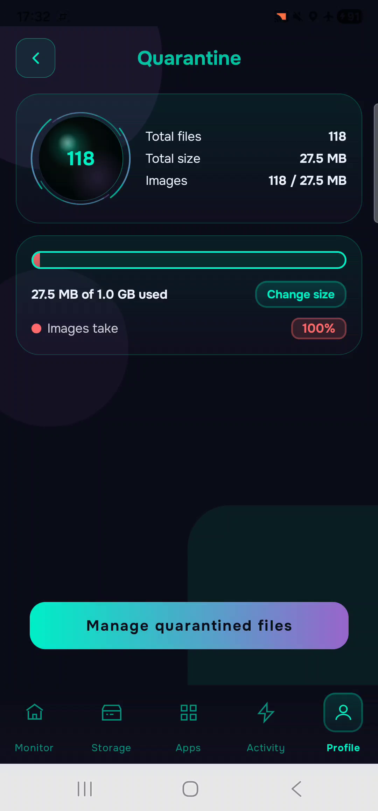

  

  <h1>METLA Cleaner</h1>

  
<b>Delete. Rethink. Restore.</b>

  
A careful storage cleaner for Android by Al Badu team. 
  Files go to Quarantine first — restore them while they’re there.

  

    <a href="https://t.me/+Me-spaSN_ZQxODUy">Join the closed test</a> ·
    <a href="https://albadun.github.io/metla-privacy/">Privacy policy</a> ·
    <a href="https://metla-cleaner.carrd.co">All links</a>
  

---

## What METLA does

- **What can be cleaned** — thumbnails, downloads, duplicates, old and large files, empty folders, sorted by category.
  Open a category, see the files, delete only what you choose.
- **Duplicates** — finds exact copies of files and keeps the original.
- **Media** — images, video, audio, documents and messenger folders.
- **Quarantine** — deleted files wait here for 7–30 days (longer with METLA Pro) and come back in one tap.
  Quarantine has a size limit (1 GB by default, adjustable): when it is full, the oldest files are removed for good
  before their time. “Delete forever” in Quarantine erases right away.
- **Apps** — see what you haven’t used in a while and remove what you don’t need.
- **Activity and Anti-Spy** — how long apps run and which of them can use the camera, microphone, location and
  contacts, with a shortcut to the settings to take that access back.
- **Device Pulse** — storage, memory, processor load, battery and how fresh the security update is.
- **App cache** — METLA shows how much there is and how to clear it in the phone settings (Android does not let one
  app clear the cache of other apps).

## Free and Pro

**Free:** scan, browse, delete what you choose, Quarantine, Anti-Spy and 3 quick cleanups a day.

**METLA Pro:** unlimited cleanup, delete or restore everything in one tap, nightly auto-clean, Radar (tells you when an
app you limited runs in the background again), live Device Pulse and longer Quarantine.

Subscriptions for 1 device or a family (up to 3 or 5 devices) — monthly, quarterly or yearly — or a one-time lifetime
purchase. Payments go through Google Play only.

## Privacy

Your files stay on your phone: scanning and cleaning happen on the device. METLA asks for permissions only for the
features that need them. The app collects usage analytics and crash reports (Firebase) — details in the
[privacy policy](https://albadun.github.io/metla-privacy/).

## Screenshots

  
  
  

## Status

METLA Cleaner is in closed testing on Google Play (version 1.3.0). Android 8 and newer, phones and tablets, English and
Russian. To join the test, come to the [testers chat](https://t.me/+Me-spaSN_ZQxODUy).

## Built with

Kotlin · Jetpack Compose · Clean Architecture + MVVM · Coroutines and Flow · Room · WorkManager · Hilt · Firebase

## By Al Badu team

[YouTube](https://www.youtube.com/@METLA_Cleaner) · [X](https://x.com/METLA_Cleaner) ·
[Telegram](https://t.me/metla_cleaner_en) · [LinkedIn](https://www.linkedin.com/in/al-badu-a34151273/)

---

**По-русски.** Удалил. Передумал. Вернул. METLA Cleaner — бережная очистка Android: файлы сначала попадают в Карантин,
и их можно вернуть, пока они там. Сейчас идёт закрытое тестирование в Google Play, чат тестировщиков:
https://t.me/+Me-spaSN_ZQxODUy

© 2026 Al Badu team. The METLA Cleaner source code is private; this repository is a public showcase.
