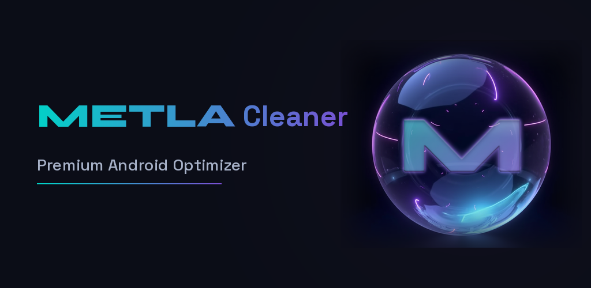
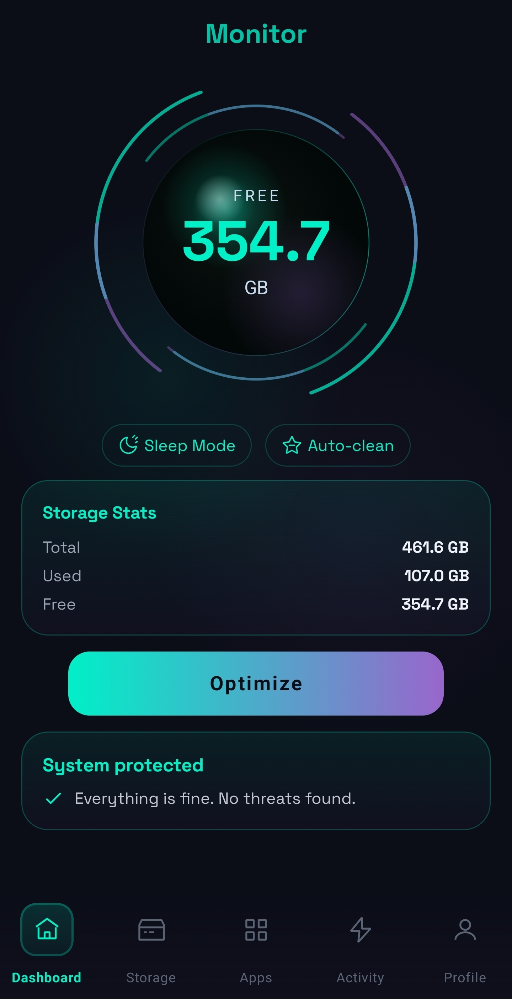
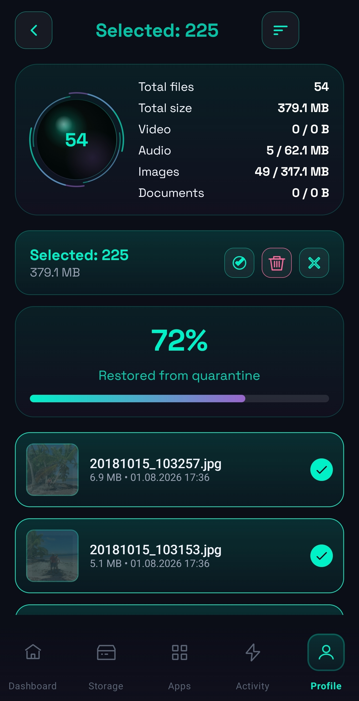

  
  
  # METLA Cleaner
  ### Premium Android Optimizer
  
  **Sees. Cleans. Keeps. Never sleeps.** 
  
  
  
  
  

   
  
  [🚀 Join Closed Beta](https://metla-cleaner.carrd.co) • [🐦 Follow Updates](https://x.com/AlBaduDev)

---

## 🌑 About METLA

METLA isn't just another cleaner. It's a statement against "scammy" optimization apps that lie about RAM boosting and battery saving. 

Built with a **Dark Cosmic** aesthetic and powered by a "Living Pulsar" UI, METLA offers a premium, transparent, and private cleaning experience for Android devices. We don't fake performance; we optimize storage with style and respect for your data.

### ✨ Key Features

-   ** Living Pulsar UI:** A unique, animated interface built with Jetpack Compose that makes cleaning feel alive.
-   **🛡️ True Quarantine:** Files aren't deleted instantly. They go to a secure quarantine zone with configurable retention, giving you full control.
-   **🔒 Privacy First:** All processing happens locally on your device. No data uploads, no cloud analytics, no tracking.
-   **🧹 Deep Clean:** Intelligent duplicate finder and cache cleaner that actually frees up space without breaking your apps.

---

##  Interface

  
  
  

---

## 🛠️ Tech Stack

METLA is built using modern Android development practices:

-   **Language:** Kotlin
-   **UI:** Jetpack Compose (Material 3 Dark Theme)
-   **Architecture:** Clean Architecture + MVVM
-   **Async:** Kotlin Coroutines + Flow
-   **Local DB:** Room

---

## 👤 Author

**Al Badu**  
*Indie Android Developer | Founder of METLA Cleaner*

-   [GitHub](https://github.com/AlBadun)
-   [LinkedIn](https://www.linkedin.com/in/al-badu-a34151273/)
-   [Twitter/X](https://x.com/AlBaduDev)

---

  Built with ❤️ in Da Nang, Vietnam
   
  © 2026 METLA Cleaner. All rights reserved.

